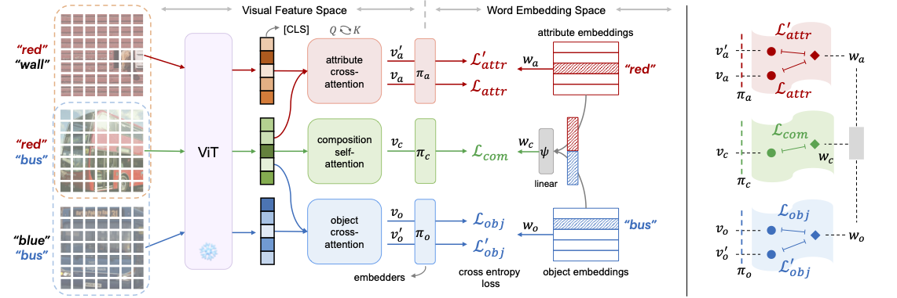

## Attention as Disentangler (CVPR 2023)
This is the official PyTorch codes for the paper:  

**Learning Attention as Disentangler for Compositional Zero-shot Learning (CVPR 2023)**  
[Shaozhe Hao](),
[Kai Han](https://www.kaihan.org/), 
[Kwan-Yee K. Wong](http://i.cs.hku.hk/~kykwong/)  
CVPR 2023  
[Project Page]() | [Paper]()

<p align="center">
    
</p>

TL;DR: A simgle and common cross-attention mechanism is efficient to disentangle visual concepts, i.e., attribute and object concepts.

### 🛠️ Setup

### ⏳ Download datasets

### 🏃 Running
#### Train
```
python train.py --config CONFIG_FILE
```
#### Test
```
python test.py --log LOG_FOLDER
```
### 🔢 Results

### 📋 Citation